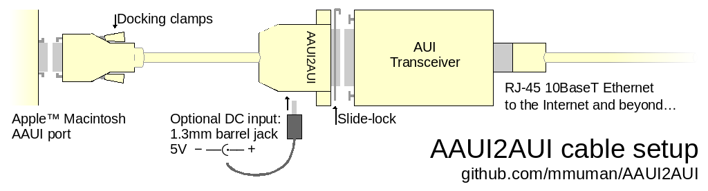
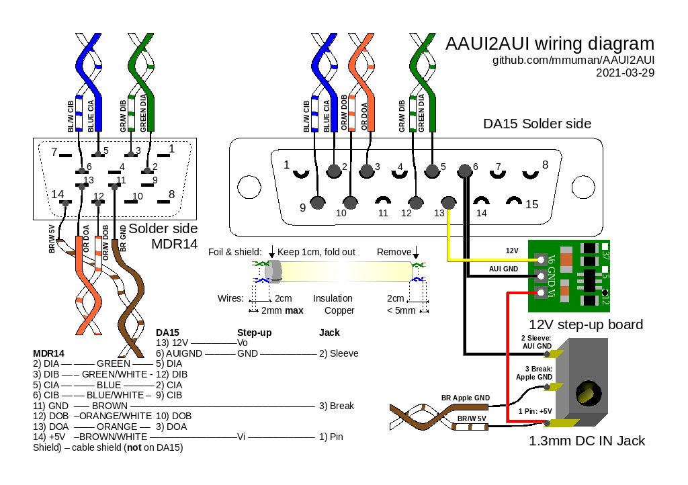

# Apple AUI to AUI adapter cable

This repo contains the description of a DIY AAUI to AUI adapter cable, kit documentation and eventually bill of material to reproduce the kits someday.

The goal is to have a cheap cable to reuse existing AUI transceivers which can be found easier and cheaper than AAUI ones and are less seeked by collectors. Although sometimes you can still find good deals on AAUI transceivers.

[AAUI](https://en.wikipedia.org/wiki/Apple_Attachment_Unit_Interface) stands for Apple AUI. It is a proprietary version of the AUI ([Attachment Unit Interface](https://en.wikipedia.org/wiki/Attachment_Unit_Interface)) connector used in early Ethernet cards to allow choosing the physical medium (coaxial cable, twisted pair or otherwise) by changing the MAU (Media Attachment Unit). AAUI was used on 68k Macintosh and early PowerPC models.

It is just the same interface but with a different connector (Micro-D 14 pins instead of a Sub-D DA15), and 5V supply instead of 12V.

## User manual

TL;DR: Plug the cable on the AAUI port on your Macintosh, plug an AUI transceiver in, plug an Ethernet cable, voila.

Some precautions must be taken with the power consumption of the AUI transceiver, to minimize the load on the Macintosh power supply.

See the full [user manual](manual_en.md). ([français](manual_fr.md))

## Ordering

TODO

## Kit assembly

Complete assembly instructions: TODO

## Theory of operation and design decisions

Here we describe how it works and why it was made so.

### Wiring

**NOTE:** As of today (2021-03-23), the AAUI pinout on pinouts.ru, Hardware Book and Wikipedia are wrong. It seems [Apple internally used a different pin ordering](http://web.archive.org/web/20010709103745/til.info.apple.com/techinfo.nsf/artnum/n9980) than the one used officially, with the bottom pins in the reverse order, so the cabling infos used incorrect numbering for pins 8 to 14. This has been confirmed by checking an Apple LC-PDS card, and powering an official Apple AAUI transceiver which only works with 5V on pins 7 and 14, not 7 and 8 (in any case the pins are facing each other at the same side of the plug).

Wiring references:
- [AppleCare Tech Info Library -AAUI: Pinout Equivalents to AUI](http://web.archive.org/web/20010709103745/til.info.apple.com/techinfo.nsf/artnum/n9980) (archive.org)
- [pinouts.ru](https://old.pinouts.ru/Net/AAUI_pinout.shtml)
- [Hardware Book](http://www.hardwarebook.info/AAUI_to_AUI)

Since we only need to convey 3 pairs of signals and one pair for power, we can use Cat5 or Cat6 cable. A shielded cable is really preferable though.

According to Apple the cable can be quite long when used for 10Base-T, however there isn't much reason to have meters long cables, and since we won't have continuous shielding we really need to keep the cable as short as possible. Apple transceivers have like 45cm of cable attached. The only benefit of having a long cable would be to have the transceiver sit on the computer case to have the LEDs visible. A length of 30cm seems sufficient though.

### 12V step-up and power

AAUI has separate pins for 5V and "PWR Fn", however most Apple products outputs 5V on all of those pins. Although some vendors do have 12V at the connector, it is assumed that the vast majority of use cases will be with Apple products. So instead of adding a way to use 12V when present, which would require something like two diodes and a wide input range (4.5V-12) step-up converter, it seemed preferable to simplify things and always use 5V input.

This might cause some issues though, because the current taken on the 5V supply will be greater than that provided at 12V, and some Macintosh PSUs might not have enough margins to 

A ready to use step-up converter board has been found that barely fits the DA15 connector shell.

The chosen board is documented for using a maximum of 1.2A at 5V, and using 1A when outputing 12V at 370mA. On a LC-III PSU which is rated for 3.75A for the 5V rail this can be a significant portion of the power budget. It's a shame since probably half of it will likely be wasted in a 5V linear regulator in the AUI transceiver itself as many RJ45 ones use 5V-powered chips. However, although some transceivers mention requirements like 300mA on the label, this is a maximum rating which is rarely taken. For examble a CentreCom 210T only takes 100mA when rated for 300mA. Still, an external DC input might be desirable for people fearing for their venerable Mac PSU.

An optional 5DC input jack as been added to the original design since a 1.3mm connector also fits inside the DA15 shell. Since the integrated plug switch is on the ring part which is usually ground, we have to cut the ground and sielding from the AAUI side when an external power is used. It shouldn't matter much because the signals are differential, so a ground isn't actually required. In theory we could have a common ground, but if the two PSU have too different outputs (like 5.1V vs 4.9V) it might cause some trouble, so better avoid this.

Therefore, the cable shield should be connected to the MicroD shell, but not to the grounding or shielding on the DA15 side.

Note the external input is 5V and not 12V, which is a bit wasteful probably, but it is easier to find small 5V supplies, including from USB ports with existing USB to 1.3mm jack cables.

An internal fuse was considered, but the ones found supposedly rated for 2A didn't break at 4.5A so probably aren't useful anyway. If you fear for your hardware, or if it becomes unstable because of excessive power load, you can still use the external 5V input.

The step-up board seems to generate quite some noise when close to the signal wires. Although it doesn't actually impact transmissions (ping -f still works fine). SZome conductive tape (aluminum or copper) around it seems to suppress those. It doesn't even seem necessary to wire it to ground or anything, so it can be left between insulation tapes.

Temperature is a concern though, with a 120mA load and the shell losely put back on, it was measured at 43°C, sometimes more. Although the board supposedly has an internal thermal protection, it is preferable to maximize the heat transfer from it to the outside of the DA15 shell. Bridging the insulated step-up PCB to the DA15 metal shield drops it to 37°C. Using some thermal transfer tape as used to put heatsinks on ICs should help. The found one has thermal conductivity of 1.2W/mk, which is at least 10 times that of kapton tape.

### Mechanical

The found 12V step-up board fits perfectly in the DA15 shell with the large side along the connector pins. Also, this placement leaves room for the cable in the middle, while other placement would have the inductance from the board in the middle of the cable.

The 1.3mm DC jack connector has the right dimensions to fit on the side of the DA15 shell with the center ping right at the junction, so a hole can be easily cut on both halves of the shell. It can probably be glued in place. In order to be flush with the shell it must be filed a bit, and the plastic bit that supposedly centers it on a PCB must be cut.

The slide-lock mechanism required for AUI, although probably not strictly necessary (and not always effective according to history), will require shaving some part of the DA15 shell, but this might make it not retain the connector itself.

Some electrical insulation will be required around the jack leads and the step-up board. Some kapton tape is put over the jack and the exposed soldered pins on the DA15 connector. Heat-transfer double-sided tape will be used, one pad on each side. Then a layer of copper tape is used to shield the step-up board, wrapping around it and extending to the inner part of the DA15 metal shell.

Since the DA15 shell is some blue-gray color which doesn't really suit Apple products, some painting could be done on it after cutting it.

Labeling can probably be done with a laser printer on some transparent sheets with white double-sided tape. Because we can.

## Tested transceivers

There is no reason this cable wouldn't work on any AAUI transceiver, but here is a list of tested models, their official rating, and the measured intensity after and before the step-up board when doing a `ping -f` to the Mac, or when idle, whatever the maximum (some actually use more when idle, because their LEDs are always on).

Model | Rated @ 12V | Measured @ 12V | Measured @ 5V
------|-------|----------------|--------------
Allied Telesis CentreCom 210T | 300mA | 100mA | 250mA
ISOLAN 1681-0 | 165mA | 50mA | 140mA
Accton EN2032 | unknown | 120mA | 310mA

## TODOs

- [ ] do we need thermal tape instead of kapton? assert thermal flow
- [ ] Make sure non-Apple cards don't send 12V on the 5V pins
- [ ] Find how to make sure the DA15 shell stick on the connector
- [ ] Try UHU Plast for the DC in jack
- [X] Assert 12V step-up interference, is shielding required? It is.
- [X] Test labeling with double-sided tape and laser-printable transparent sheets (actually some laser-printable transparent stickers will be used)
- [X] Find proper paint for the DA15 shell
- [X] Write user manual
- [ ] Write kit assembly guide
- [ ] Fix pinouts.ru & Wikipedia
- [ ] Publish DA15 shell cut template for the DC in jack hole
- [ ] Publish BOM and part sourcing infos
